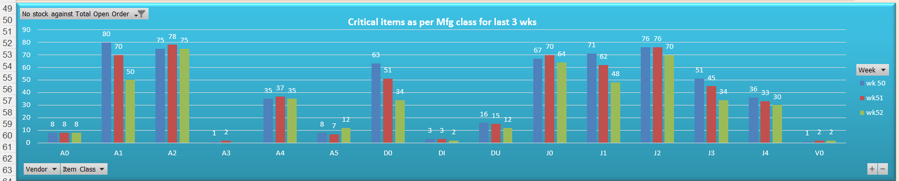
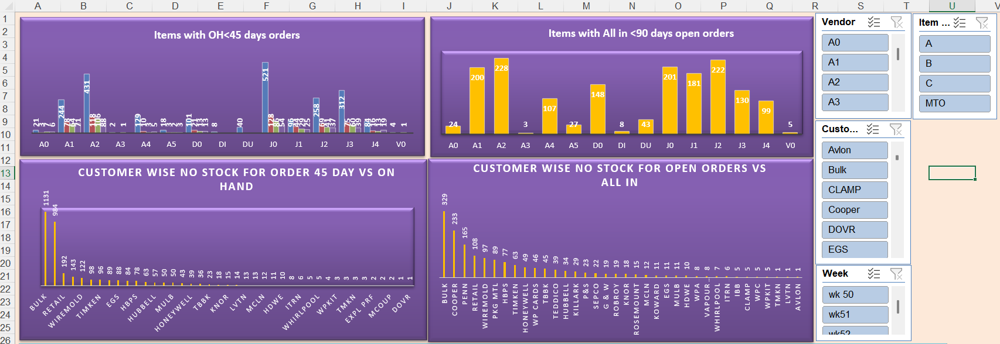
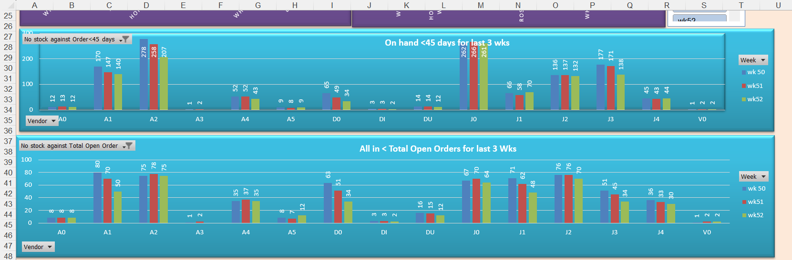

# Inventory Monitoring & Stock Shortage Dashboard (Excel)

An Excel-based inventory analytics dashboard designed to monitor stock availability, identify critical shortages, and support operational and supply-chain decision-making.

This project demonstrates how raw inventory and open-order data can be transformed into **actionable insights** using Excel dashboards and KPI-driven visuals.

---

## 🎯 Objective

To provide a clear and structured overview of:
- Items with **no stock against open orders**
- Items where **on-hand stock is below critical thresholds**
- Customer-wise and item-class-wise shortage trends
- Week-on-week comparison for the **last 3 weeks**

---

## 📊 Dashboard Results (Quick Visual Overview)

### 1️⃣ Critical Items by Manufacturing Class (Last 3 Weeks)
This chart highlights item classes with **no stock against total open orders**, tracked across multiple weeks to identify persistent and recurring shortages.

---

### 2️⃣ Items with On-Hand < 45 Days & All-In < 90 Days
This view shows inventory risk where:
- On-hand stock is insufficient to cover the next 45 days
- Total available supply (All-In) is below 90 days of demand

---

### 3️⃣ On-Hand < 45 Days vs Total Open Orders (Last 3 Weeks)
Week-wise comparison by item class to prioritize replenishment actions and highlight worsening or improving stock situations.

---

## 🔑 Key Insights Enabled
- Identification of **high-risk item classes** with repeated shortages
- Customer-wise visibility of stock gaps impacting open orders
- Trend comparison across weeks to detect supply risk patterns
- Faster decision-making for **procurement and replenishment planning**

---

## 🛠 Tools & Techniques Used
- **Microsoft Excel**
  - Pivot Tables
  - Advanced Formulas
  - Conditional Formatting
  - Charts & KPI Visuals
  - Slicers (Vendor, Item Class, Customer, Week)

---

## 📁 Repository Structure

inventory-monitoring-dashboard-excel/
├─ data/
│ └─ raw/
│ └─ stock_less_than_all_in_qty.xlsx
├─ docs/
│ └─ metrics.md
├─ screenshots/
│ ├─ dashboard_overview.png
│ ├─ onhand_vs_allin.png
│ └─ onhand_vs_openorders.png
└─ README.md

---

## ▶️ How to Use
1. Open the Excel dashboard workbook
2. Refresh pivot tables and charts if needed
3. Use slicers to filter by vendor, customer, item class, or week
4. Review highlighted shortages and prioritize actions

---

## 💼 Use Case Relevance
This dashboard is suitable for:
- Inventory Planning
- Supply Chain & Operations
- Procurement & Vendor Management
- Production Planning Support

---

## 🚀 Why This Project Matters
This project reflects **real-world operational reporting**, where Excel remains a core tool for quick analysis
